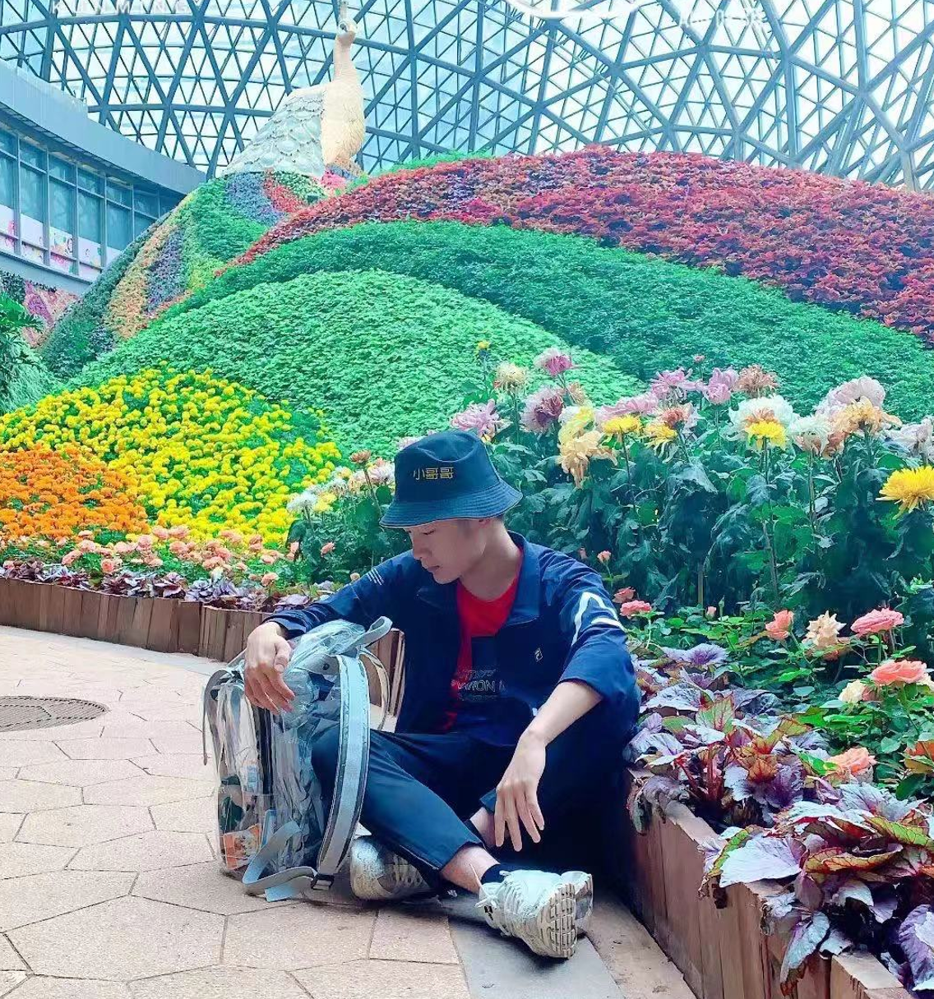
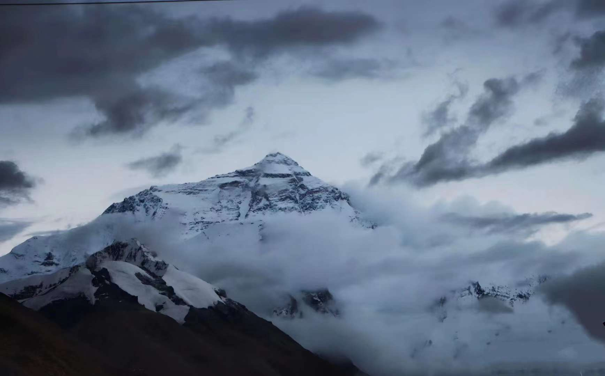

***
## My selfie when 18
***

***
## My undergraduate story(Chinese Version)
***

    *这可能是一个满怀不甘但依旧精彩的故事。现在看来所做的一切都是兴趣使然。三分钟的热度也有三分钟的收获*
#### 大一：

    带着一本驾照和对未知的期待，这个颇轻视困难的傻小子闯入了这个陌生的地方。九月，他还未见识北京的冰雪寒风，染着朝阳般的杏树暗示着即将到来的挑战。
    从英语分班谈起，凭着中原大陆的底子和并不充分的准备进了B班。虽然也拿到了口语面试的机会，但仅有的准备也只是听过几首英文歌。不得不承认大学前两年的英语课鄙人是敷衍过去的，很难想象这个最终打算远游的小子英语课曾经拿过2.7。这份遗憾也和当时对未来出路的规划有很大关系，最开始想的是保研是性价比最高的努力方向，加上其它兴趣和琐事，并未重视语言学习。“出国？那绝对不可能啊。”，记得当时和朋友说过这句话。
    而当年唯二参加的学院活动是健美操队和学院生活权益部，不得不说当时参加活动的初心幼稚且短见——一切为了保研加分。这也导致了之后对这类活动的偏激认识与偶尔漫不经心的态度。现在看来大多组织的中心二字是“责任”，我也很庆幸有一群包容我的同辈和师兄师姐。但进入冬季后一切问题显现，比如晚上训练后发热入睡难、和舍友交流联系太少、经常丢三落四等生活上的问题。于我而言，不得不说大半阻碍安心学习的挑战来自于日常生活，而非课程难度。如果丢卡，请记得配好卡套和卡带；如果丢钥匙，把钥匙放在门上即可；如果丢失了前进的勇气，不妨听听歌或者去找朋友倾诉；如果作为新生的你能看到这篇自述，我很荣幸能在生活上给出小tips。
    由于环境的不适应、集体生活的处理不当、异地恋的突然终结、以及期末的连续高烧，大一上给我的是生活上的警示和不尽人意的成绩。而寒假的疫情爆发，导致延期开学和线上上课，但这同时也给了我机会去反思并弥补之前学绩上的不足。值得一提的是，我的科研之路也恰好是在那个寒假铺开：作为健美操前辈的苏苏（化名）在寒假联系我一起对疫情问题做出讨论，彼时我也有幸成为学院最年轻的科研基金负责人。

#### 大二：
    因为一个学期未返校，大二的我又像新生一样进入了校园，只不过这次是多了对待学习生活的谨慎和学校的出入校申请。彼时专业已分，跟着直觉成为一班统计学的一份子。我心里很清楚来到这个专业的人都“身怀绝技”，这也是大一自我介绍颤颤巍巍，没能成功竞选班委的一个重要原因。而根本原因是对出路的迷茫和对自己的能力的不自信。我知道前方的未知太多了，已经有一个学期验证了我无法很好地去应对。而也是这个时期我转变了对出路的看法：既然我不能确定用五个学期去弥补一个学期的不幸，既然我不能选上班委给自己的811多加两分儿，我是不是该换个思路呢？
    说巧不巧，新同班同学波波（化名）喊上了俺一起学英语，诶，我想毕业后出去看看也不一定是个坏事，就算只有两年甚至一年。而我那时候并没有想到自己将走上一条更为艰难的道路……不出意外的是，鄙人大二上的绩点又掉下去了不少。但值得一提的是，另外两段科研经历也是在这个学期完成的，而我那时除了每周六还得七点以前起床、迎着寒风和兄弟一起学英语之外，愧疚而又纠结的是不能帮健美操后辈好好训练，个人觉得自己能力不足而去操心别人是一种愚善，而事实上在这里每一份付出都是有它的道理的。每个人有他自己的节奏，但适用于大多数人的一个规律是：如果放弃分内的一件事，其他事情也会不自觉选择放弃而不付出真心，这也是来自高中时英语老师说的，“放弃是一种习惯”，而在此学期也验证了它的正确性。之后大半学期是鸽了波哥，确实在心理上没做好每周每月连轴转的准备。而大二上过程不头疼但结果让我头疼的概率论课程又给我当头一棒，不适应统考的应用向的题目，满脑子是中心极限定理的证明但基本的协方差拆分却不会，“喜提”2.7让我又过了一个很致郁的寒假。
大二下是半放弃地选择了辅修二专业，决定完全放飞自我学想学的，但学习态度上还是有转变，每周基本上会趁着不冷的晚上在明法台阶上整理数理统计的笔记，1058也逐渐成为了我的庇护所，“会计学”学起来感觉很实用，至少能教会我记账；“宏观经济学”很有魅力但是学的半懂不懂；“经济社会统计”我完全是一节课都摸不着头脑，当然之后的分数也不理想，但除本课程之外，包括“实变函数”在内的所有课程最终的取得了较好的成绩，也算是过得相当自由顺利的一个学期。
可能是因为春季学期给我的强势buff，精力会好很多，彼时自己报了UCL的暑期学校，但由于疫情只能改为线上，也是那时候学会了如何办VISA卡、如何准备英文面试。而到暑假，除了暑期学校的两周的忙碌外，还和本校经济学院的导师联系了科研实习，虽然最终是拿来当做本科实习，但也是熟悉了Python爬虫的一个重要经历，同时也强化了我对真正统计向科研的渴望。UCL的暑期学校是从七月上旬到下旬，而由于疫情，19级的军训被延迟到了七月末八月初，我的暑校最终报告是在军训的第一天前提交，质量堪忧，但是过程非常宝贵，老师的上课风格和质量很难让人不爱，彼时也是第一次见识国外数据科学类的教育体系的先进完备，第一次系统地学习了R语言，也为大三的学习和国赛做了一定的铺垫。之后通过邮件和网页查询才知道老师是著名统计学家Fisher的学生的学生，故鄙人也算是与统计创始人建立了某种联系。

#### 大三：
因为是在2021年9月4日选择中介决定去向，且大三所有事件均能与申请发生联系，故在此部分叙述大三经历，并重点谈谈选校申请事宜。
现在看来还是很难想象当时被中介“忽悠”着要申请美博这件事，个人看来这是所有去向中准备上限最高、但结果下限最低的一条不归路，我还是不明白为什么这种一辈子的事要让一个20岁的小青年在那一瞬间决定，可能20-30岁是最无力但是又要做最多重要决定的时期吧。但如果没有当时家人的支持和中介的“忽悠”，我可能更倾向于申请就业向的硕士（能只有一年就再好不过了），而非如今拒了很多PhD的机会还想无限延长与统计学缠斗的时间。
带着难以名状的压力和决定放手一搏的态度，我开启了大学的第三个秋季学期。这次不想抱憾而归、想赢不想输、想尝试所谓的“认真一点不要敷衍”。而也是这个学期，让我确信我的某部分实力是货真价实的。当然很重要的一个“导火索”还是得从本科第二次国赛谈起，首先很抱歉没完成当初一起拿国奖的约定（很戏剧性的是队友回来半个学期潇洒地拿走了最后一个学年的国奖），可能是因为数理统计课程的加持、以及Phil教授暑假的教诲，队员三人虽然是线上合作比赛，且前期并没有任何磨合准备，但也拿了国二里的高分。之后知道两位队员是大二年度的国奖得主，也瞬间觉得这事能办顺是水到渠成的事，同时也让我认识到在本校有很多值得争取的东西，开始有了目标有了追求，这应该是大三上最宝贵的财富。当然之后统计明理健美操联队拿了特等奖也在学期中途给了我莫大鼓励，因此觉得有些奇迹值得用尽全力去触碰。
而具体到本学期的学习线，大概可以分为两个时期，第一个时期是九月初到十月国庆假期的语言学习，彼时TOEFL延期了第五次，非常折磨，因为我觉得语言这事，是属于输入很多但没有实际产出，看不到成果的东西。国庆去内蒙考了一次，过了大部分学校的线，也在当地见识了大草原；第二个时期属于全力学习不回头的，也是这个阶段重启了大一下的“时间线学习法”，因为之前说过其实学业难度于我来说不是太大的阻力，更加重要的是生活上的安排和心态调整，于是第一周摸清楚了整个学期的时间走向，会在半个校历中标出重要的时间点，这也少不了师兄师姐的帮助，尤其是统计学专业大三上学期的专业课非常密集，而课程给分又是四个专业混给，竞争强度并不均衡。记得当时到了期末有五个大作业和四个期末考，且疫情学校安排提前考，得亏给力队友的合作和每周细致的时间安排才能开心结束大三上学期。因为部分学校申请很看重专业课和大三的学分绩（有些申请系统称为Junior GPA），所以这学期的努力在之后申请中也起了较大的作用，尤其是看到WES认证（不同于一般GPA）时连着三个学期的满绩（3.7会转换为4.0），当时心里就有底多了。而那个学期没有满绩也是因为第一个时期花在语言上太多时间，编程课作业没有尽心做（卷），平时分不太高。同时会分心的是找海外科研经历，当时会广搜教授的招研意愿，彼时是属于运气溢出联系到了MIT的人工智能导师（但是与后来的申请方向极不匹配，所以申请结果也非常一般，如果根据科研决定申请方向，大概之后会往DS或者CS走了，但鄙人就是想学统计呀），于是在大三下提前跟着导师做了点科研，作为独立作者发了篇CPCI。
大三下投稿后，因为疫情紧张提前回家了，6月初的生日礼物就是稿件被录用，当时觉得20岁就有发表是很值得让全世界知道的事，但这件事本身的难度，如果其他人有意愿去做，也是极有可能的，同时这篇是属于大牛引导的Review，算不上真正的研究，故只放入简历而较少与朋友们提及。因为回家后心态过于积极（很适应南方潮湿温暖的环境，“如鱼得水”），乐极生悲，这也给后期申请上的种种失误埋下了伏笔。同时回家后整体比较懒散，课程学习上也稍显随意，特别是实验设计提前一个小时交卷但是分数一般，这多少有点不尊重在校内努力的那三个月，同时这也是最终没能和队友兑现承诺的一个重要原因。
大三暑假则主要是刷语言成绩，但没想到也就是这两个月的五次延期让我申请季的心态跌入谷底，七月的第一次TOEFL已经100+了，第二次模考大概在108左右，但是延期到了7.26，二刷时口语还差1分达标，于是又约了下个星期的，结果因为广州考点区域爆发疫情延期到了9月上学前后的时间，于是我的TOEFL成绩定格在了口语差1分，总分很一般的情况，尽管我认为那次莫名其妙的延期可以真真切切地改变我的去向，但实际很难说它们对申请产生了多大的影响，因为据说学校是过了线就不会再看申请人的语言成绩，当然除了金融、法学等极其内卷且需要强语言能力的专业。而GRE的考试则较为友好，大陆学生不考听力口语，只是刷题也占足优势，但GRE一般的分数也至少需要15000的词汇量，也是四六级考生的两三倍，难度对大多数人来说也不低，所以也需要几个月的时间提前背词。而对常规的PhD申请者来说，大三暑假是进行暑研的阶段，我也因此错失了第二个海外科研机会。总的来说，语言学习是整个申请流程中让我最头疼的部分，同时也让我错失了很多美好假期和科研机会。
因为自己很清楚读博是一辈子的事，随便申请一个保底去上是很不尊重自己时间和才能的选择，也许之后会有博士后进修等等，但在哪读博基本上确定了学历水平的上限，同时基于自己很想出去看看的初心，遂没有考虑国内的夏令营，而包括港中文PhD提前批，自己也是用一半的申请材料过了初审，但之后觉得去面试有悖初心，即学校非常好，但不符合自己远游的想法，遂在第一天和教授写信放弃了面试机会（8月14日）。之所以提交申请是因为想第一次精修文书和熟悉PhD的面试，且提前批申请不需要推荐信。

#### 大四：
第四个秋季学期虽然在家也相当致郁，很难绷一个人在家写文书、套磁、刷TOEFL，心里落差很大。因为本来打算的是暑假刷完所有语言美美返校，但九月初的那次考试考完之后就没法进京了，加上延迟一个月的考试状态也很一般，就占着地理机会打算还和语言缠斗一个月，那时候已经没什么考试动力了。因此选了几门比较有用有意思的课程，当了“回归分析”课程助教和老师同学互动解闷，学会了写R包，用Armardillo编写软件底层语言，总的来说还是相当实用有趣的，之后在CRAN上发了一个包，如今没更新应该下架了，但副本还存在Github里。那段时候内耗相当大，因为美研、美博的申请截止日最早是在12.1，和语言缠斗到10.15也没什么巨大进展，遂放弃挣扎，开始选校和联系推荐信。不得不说语言再一次耽误了我选校环节，选校不仅需要良好的信息来源，也需要申请人本身对这些信息的筛选。比如有的学校每年只招五个PhD，有的学校常年只招美本，有的学校常年只收硕士生读博，有的学校是MS/PhD学位，意味着前两年可能资助得完全从RA或者TA中出，而在我申请阶段对这些是完全不知情（真不能全指望中介，还是得自己慢点细筛）。如果申请生物统计，部分学校需要在Sophas中心系统上进行统一申请，好处是多个学校只需要一次推荐信，且WES认证成绩一般会高于GPA，但是整个系统需要一个月的时间传入成绩，所以得提前准备。另外，推荐信、科研和申请方向的匹配非常重要，如果不是真的热爱自己的本科学科也要考虑申请其它学科或者转申硕士的可能性。在统计和生物统计的申请中，套词的作用并没有那么大，因为很少学校在这两个学科上安排面试，同时很多决定是委员会出的，进入院校后并非直接跟导师，通常有两三年的课程学习时间。
回望2022年相当不顺，11月初提交了几个学校的申请之后，整体放开，家里的年长者陆续抱恙，一家人回到老家送走爷爷奶奶，也都得了新冠。有段时间自己在家看完《赛博朋克：边缘行者》，持续了一两个星期emo，但之后想通了主人公们也并非是一无所有，至少Lucy上了月球，其他人相识相遇，David站上了荒坂大厦，实现了对妈妈的承诺。整体过于“写实”，映射到现实则是一个孤独人儿躲在家里祈望实现梦想不让在乎他的人们失望，不让自己觉得遗憾。
11.21交完所有的申请，12月中旬复习完期末，跨年和珠海的朋友去海边看烟花，遂结束了复杂的2022年。 1.16哥大梅尔曼学院截止申请，1.18发了降录offer，也是第一个offer，就算如今不选择哥大，也会非常感谢能在那天晚上给我和我的家人一个好消息，算是挽救了三年来第一个热闹年。2.3接到新国立（这个学校的申请当时也是当试错，所以材料也没交全，offer被committee卡着，五月份才出，所以不等了）的面试，很简短，基本上就是互相聊聊，对基本信息的确认，因为统计和生物统计的PhD大都没有面试，所以之后干等了两个月的offer，最终还是接了哥大生统，一来是给的是PhD track，之后不管是内保还是外申都有不少机会，本校生物统计专业排名也很耐看，研究生综排也不在本科排名造假风波的影响之内，加上哥大身处纽约曼哈顿的地理环境很符合我对未来去向的幻想，医学院本身提供傍河雅景的宿舍；再者是因为读博确实是一年前拍脑门的决定，虽然从去向广度、未来实际薪资待遇来说，读博值得争取，但是有条件的情况下走走看看也无可厚非，故不再纠结各种waitlist和其它offer。
申请是综合个人能力和时运的事情,谁也没法预料三年前的疫情爆发,但不管这个大环境给各种去向的人多大的阻力,准备充分的人还是能在各种风波里占到优势位。不得不说当时的决定很唐突，同时在申请季的准备不够充分，心态也没办法调整，但凡此种种都是宝贵的经历。虽然人的年龄不可逆，但读书这件事是有想法可以无限续上的，同时每个人一辈子的节奏也不同，就算24岁博士毕业也没法决定一个人的整体状态和未来走向，过于焦虑不可取，时代本身浮躁，适当妥协也可能是上策。
而对后浪来说，哪怕这篇自叙对你的决定有一丁点的帮助，或者能让你获得动力与共鸣，那它则是实现了额外价值。

#### 总结
    “责任越大，能力才能越大”，这是从“蜘蛛侠”学过来的翻版，因为没有人能像蜘蛛侠那样被蜘蛛咬而赋予超能力，所以个人认为“能力越大，责任越大”是在前者基础上的觉悟。从个人经验来看，这是一个长期的过程，只有认识新的人、接下新的机会并认真对待，个人的能力才能得到真正的提升，进而才能承担起更多责任。同时要保持开明，在这路上每个人总会遇到真心相待的朋友，他们的信息和想法很重要，而合理运用信息资源取胜也并非是见不得光的事，热血的人当然向往1对1的公平竞技，但是胜利往往也是智取而非单方面绝对实力上的对抗。空城计有它本身的热血，Megalobox亦有它“无甲之乔”的热血。同时一个实际的问题是很多同学会为了名利放弃身心，有些东西确实值得争取，但在我看来大部分成功还是以绝对的身心素质为基础的。大二大三因为种种原因落下体育锻炼，从当年的1000米满分到如今的BMI肥胖认证，再来一次我虽然还是会在大三选择赌上一切，但生命中大部分事情是不值得拼命的。同时胖的时期完全不是认真科研学习的那段时间，而是在家待了一年（大一下和大四上），且在学校常常闲着管不住嘴（害羞）。故大四下的目标则是减减脂，看看景。
    在此，感谢永远支持我，给我超大容错空间的父母，虽然我是一个敏感又偏执的人，但你们仍包容我默默陪伴着我，希望你们永远健康和睦；感谢在我决定去向时，愿意为我提供帮助的林老师、许老师、孙老师，老师们的关心与支持让我在孤独的申请季倍感暖心；感谢热情拉我进健美操大家庭的师兄师姐们，在这里我遇见了多样又优秀的灵魂；感谢既是我的健美操师兄、又是我的科研启蒙者，苏锦华前辈，愿我们前程似锦；感谢在1058党建之家遇到的小伙伴们，是你们帮我开启了未来视野，很庆幸能在最迷茫的时候遇到你们。还是很开心入学时与三班的娃娃们相识，之后又与Ravenclaw智慧班的统计人汇合；感谢良波、秋燃、月姐、开远同在PhD这条路上的陪伴与分享，’wholeheartedly wish you success in your educational pursuits and all future endeavors^^’(拒信常用语但是于此语境饱含真心!)。感谢116、115的室友们，和你们在一起我很幸运。也很感谢我追的无数番剧美剧，《思维覆写》、《神之塔》让我相信“林先生的风和山”和“黑暗中唯一的光”，让我在最躁郁的阶段懂得努力与感恩；《异度侵入》让我再次感叹于善恶的融合与碰撞；《在下版本》、《入间同学入魔了》、《间谍过家家》、《路人超能》让我相信“1+1>2”；《上载空间》、《黑袍纠察队》、《伞学院》让我沉浸在异世界...感谢大学的第一个队友林书瑜，耐心教我口语虽然彼时我漫不经心，之后的第一个政治课pre也一起栽坑，有很多不愉快，但是如今看来都是有了巨大成长；感谢那个教会我“要燃烧自己过着热烈生活”的人，尽管我们不够互相了解、尽管在很多观点上我们会碰撞（虽然之后没有碰撞的机会了），我依然会常常梦到那个夏天，一起依偎在长椅上看着风景，很久没联系了，也希望你健康快乐、学业顺利。
    

    

